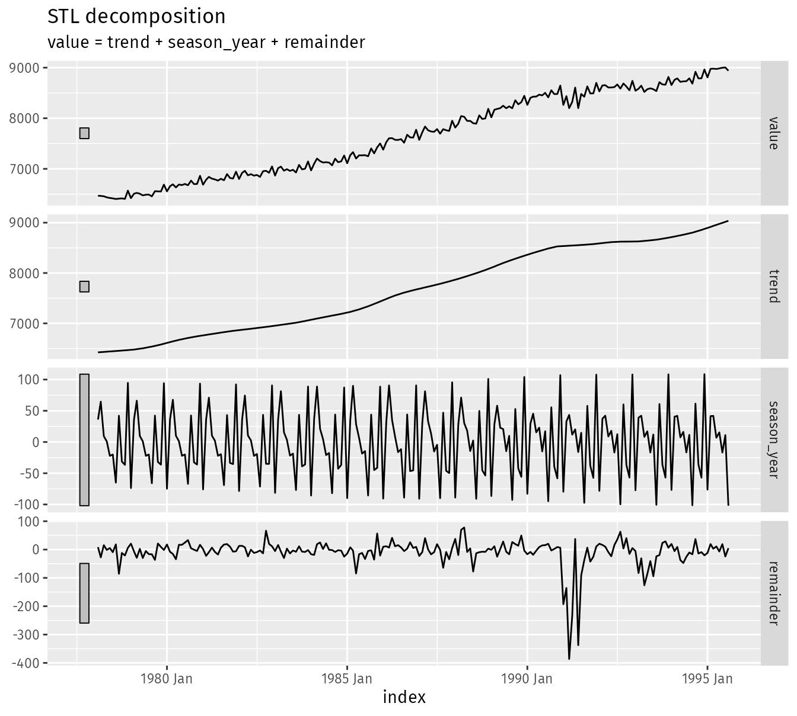
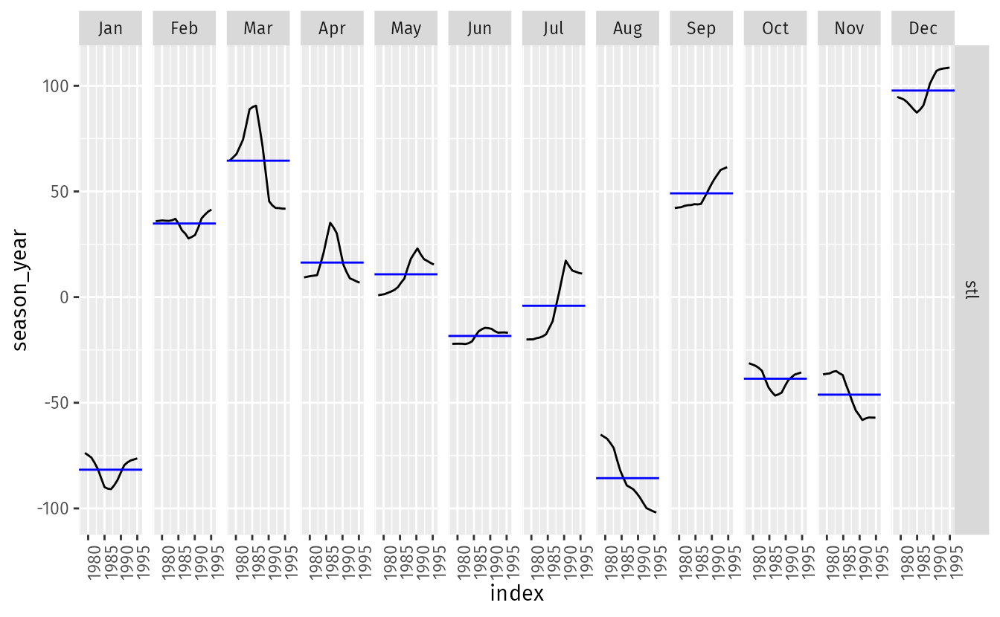

```{r setup, include=FALSE}
knitr::opts_chunk$set(echo = TRUE)
```

# Homework 2

```{r loadLibraries, warning=FALSE, message=FALSE}
library(fpp3)
library(tidyverse)
library(latex2exp)
```

## Exercise 3.1

<blockquote>
Consider the GDP information in `global_economy`. Plot the GDP per capita for each country over time. Which country has the highest GDP per capita? How has this changed over time?
</blockquote>

```{r warning = FALSE}
gdp <- global_economy |>
  mutate(GDP_pc = GDP / Population) |>
  select(Country, Year, GDP_pc)

gdp |>
  autoplot(GDP_pc, show.legend = FALSE) + 
  labs(title = 'GDP per Capita',
       y = 'GDP ($US)')
```


```{r warning = FALSE}
top_countries <- gdp |>
  group_by(Country) |>
  mutate(maxGDP = max(GDP_pc, na.rm = TRUE)) |>
  distinct(Country, maxGDP) |>
  arrange(desc(maxGDP)) |>
  head(5) |>
  select(Country)

gdp |>
  inner_join(top_countries, by = join_by(Country)) |>
  autoplot(GDP_pc) + 
  labs(title = 'GDP per Capita',
       subtitle = 'Top 5 Countries',
       y = 'GDP ($US)')
```

Monaco has the highest GDP per Capita in the dataset. In the last several years Lichenstein has been very close to Monoco, and was higher in some years.

## Exercise 3.2

<quoteblock>
For each of the following series, make a graph of the data. If transforming seems appropriate, do so and describe the effect.

* United States GDP from `global_economy`.
* Slaughter of Victorian "Bulls, bullocks and steers" in `aus_livestock`.
* Victorian Electricity Demand from `vic_elec`.
* Gas production from `aus_production`.

</quoteblock>

### United States GDP

```{r}
global_economy |>
  filter(Country == 'United States') |>
  autoplot(GDP / Population) + 
  labs(title = 'US GDP per capita',
       y = '$US')
```

Transformed GDP to a per capita value.

### Slaughter of Victorian "Bulls, bullocks and steers"

```{r}
aus_livestock |>
  filter(Animal == 'Bulls, bullocks and steers',
         State == 'Victoria') |>
  autoplot(Count)
```


### Victorian Electricity Demand

```{r}
vic_elec |>
  autoplot(Demand)
```

The half-hour time scale makes the graph difficult to read. We can transform the data into a daily demand chart.

```{r}
vic_elec |>
  group_by(Date) |>
  mutate(Demand = sum(Demand)) |>
  distinct(Date, Demand) |>
  as_tsibble(index = Date) |>
  autoplot(Demand) + 
  labs(title = 'Daily Victorian Electricity Demand',
       y = 'Demand (MWh)')
```

There are still considerable fluctuations in the daily data and may be better to view as a monthly summary since we expect most electricity demand to come from cooling.

```{r}
vic_elec |>
  mutate(Date = yearmonth(Date)) |>
  group_by(Date) |>
  mutate(Demand = sum(Demand)) |>
  distinct(Date, Demand) |>
  as_tsibble(index = Date) |>
  autoplot(Demand) + 
  labs(title = 'Monthly Victorian Electricity Demand',
       y = 'Demand (MWh)')
```

It is easier to see here that peak demand is occuring in the summer months and periods of low demand occur during the winter months.

### Gas production

```{r, fig.show = 'hold', out.width = '50%'}
aus_production |>
  autoplot(Gas) + 
  labs(title = 'Autstrailian Gas Production',
       y = 'Production (petajoules)')

lambda <- aus_production |>
  features(Gas, features = guerrero) |>
  pull(lambda_guerrero)

aus_production |>
  autoplot(box_cox(Gas, lambda)) + 
  labs(title = 'Austrailian Gas Production',
       subtitle = TeX(paste0('Transformed with $\\lambda$ = ', round(lambda, 2))))
```

Transformed the Gas production data using $\lambda = 0.11$ to standardize the seasonal variation.

## Exercise 3.3

<blockquote>
Why is a Box-Cox transformation unhelpful for the `canadian_gas` data?
</blockquote>

```{r}
canadian_gas |>
  autoplot(Volume)
```

A Box-Cox transformation is unhelpful with the Canadian gas data because the seasonal variability between 1975 and 1990 is significantly larger than earlier and later periods. The Box-Cox transformation is good when the seasonal variation increases or decreases over time. 

## Exercise 3.4

<blockquote>
What Box-Cox transformation would you select for your retail data (from Exercise 7 in Section 2.10)?
</blockquote>

```{r}
set.seed(31415)
myseries <- aus_retail |>
  filter(`Series ID` == sample(aus_retail$`Series ID`, 1))

myseries |>
  autoplot(Turnover)
```

```{r}
myseries_lambda <- myseries |>
  features(Turnover, features = guerrero) |>
  pull(lambda_guerrero)

myseries_lambda
```

With a small negative lambda value calculated using the guerrero feature, I'd select $\lambda = 0$, and apply a log transformation.

```{r}
myseries |>
  autoplot(log(Turnover))
```

## Exercise 3.5

<blockquote>
For the following series, find an appropriate Box-Cox transformation in order to stabilize the variance.

* Tobacco from `aus_production`
* Economy class passangers between Melbourne and Sydney from `ansett`
* Pedestrian counts at Southern Cross Station from `pedestrian`

</blockquote>

### Tobacco

```{r}
aus_production |>
  autoplot(Tobacco)
```

```{r}
lambda <- aus_production |>
  features(Tobacco, features = guerrero) |>
  pull(lambda_guerrero)

lambda
```

With a $\lambda = 0.93$, the seasonality of the Tobacco data is relatively stable and probably makes the most sense to leave without a transformation.

### Economy class passangers between Melbourne and Sydney

```{r}
ansett |>
  filter(Airports == 'MEL-SYD',
         Class == 'Economy') |>
  autoplot(Passengers)

```

```{r}
lambda <- ansett |>
  filter(Airports == 'MEL-SYD',
         Class == 'Economy') |>
  features(Passengers, features = guerrero) |>
  pull(lambda_guerrero)

lambda
```

Applying a box-cox transformation with $\lambda = 2$.

```{r}
ansett |>
  filter(Airports == 'MEL-SYD',
         Class == 'Economy') |>
  autoplot(box_cox(Passengers,2))
```

### Pedestrian counts at Southern Cross Station

```{r}
pedestrian |>
  filter(Sensor == 'Southern Cross Station') |>
  autoplot(Count)
```

The hourly pedestrian counts is too busy to determine the pattern and also contains a lot of near zero intervals.

```{r}
weekly_ped <- pedestrian |>
  mutate(Week = yearweek(Date)) |>
  group_by(Week) |>
  mutate(Count = sum(Count)) |>
  distinct(Week, Count) |>
  as_tsibble(index = Week)

weekly_ped |> 
  autoplot(Count)
```

```{r}
lambda <- weekly_ped |>
  features(Count, features = guerrero) |>
 pull(lambda_guerrero)
lambda
```

Applying Box-Cox transformation with $\lambda = 2$.

```{r}
weekly_ped |> 
  autoplot(box_cox(Count, 2))

```

There appears to be significantly less pedestrian traffic on the new year's day holidays shown within the dataset.

## Exercise 3.7

<blockquote>
Consider the last five years of the Gas data from `aus_production`.
</blockquote>

```{r}
gas <- tail(aus_production, 5*4) |> select(Gas)
```

> a. Plot the time series. Can you identify seasonal fluctuations and/or a trend-cycle?

```{r}
gas |>
  autoplot(Gas)
```

Natural gas is primarily used for heating. As expected, we see seasonal peaks during the winter and lows during the summer. The overall trend is increasing.

> b. Use `classical_decomposition` with `type = multiplicative` to calculate the trend-cycly and seasonal indices.

```{r, warning=FALSE}
gas_dcmp <- gas |>
    model(classical_decomposition(Gas, type = 'multiplicative'))

gas_dcmp |>
  components() |>
  autoplot()
```

> c. Do the results support the graphical interpretation from part a?

Yes, the trend is increasing and the seasonal components follow the pattern as previously described.

> d. Compute and plot the seasonally adjusted data.

```{r}
gas |>
  autoplot(Gas, colour = 'gray') +
  autolayer(components(gas_dcmp), season_adjust, colour = '#0072B2') + 
  labs(title = 'Seasonally Adjusted Gas Production')
```

> e. Change one observation to be an outlier (e.g., add 300 to one ovservation), and recompute the seaonally adjusted data. What is the effect of the outlier?

```{r}
gas_outlier <- gas |>
  mutate(Gas = ifelse(Quarter == yearquarter('2007-Q2'),Gas + 300, Gas))

dcmp_outlier <- gas_outlier |>
  model(classical_decomposition(Gas, type = 'multiplicative'))

gas_outlier |>
  autoplot(Gas, colour = 'gray') +
  autolayer(components(dcmp_outlier), season_adjust, colour = '#0072B2') + 
  labs(title = 'Seasonally Adjusted Gas Production with Outlier')
```

> f. Does it make any difference if the outlier is near the end rather than in the middle of the time series?

```{r}
gas_outlier2 <- gas |>
  mutate(Gas = ifelse(Quarter == yearquarter('2010-Q2'),Gas + 300, Gas))

dcmp_outlier2 <- gas_outlier2 |>
  model(classical_decomposition(Gas, type = 'multiplicative'))

gas_outlier2 |>
  autoplot(Gas, colour = 'gray') +
  autolayer(components(dcmp_outlier2), season_adjust, colour = '#0072B2') + 
  labs(title = 'Seasonally Adjusted Gas Production with Outlier')
```

An outlier in the middle of the time series has more of an impact on the periods on either side of the outlier. 

## Exercise 3.8

<quoteblock>
Recall your retail time series data (from Exercise 7 in Section 2.10). Decompose the series using X-11. Does it reveal any outliers, or unusual features that you had not noticed previously?
</quoteblock>

```{r}
x11_dcmp <- myseries |>
  model(x11 = X_13ARIMA_SEATS(Turnover ~ x11()))

x11_dcmp |>
  components() |>
  autoplot()
```

The seasonal component of the series is on the same scale as the irregular component.

## Exercise 3.9

> Figures 3.19 and 3.20 show the result of decompsing the number of persons in the civilian labour force in Australia each month from February 1978 to August 1995.





> a. Write about 3-5 sentences describing the results of the decomposition. Pay particular attention to the scales of the graphs in making your interpretation.

There is an overall increasing trend in the civilian labor force in Australia. There is a seasonality to the data, but it is on a very small scale relative to the trend and remainder, which indicates that it's not a strong influence. 

> b. Is the recession of 1991/1992 visible in the estimated components?

The recession of 1991/1992 is can be seen with a flattening of the trend compoenent and significant varaitions in the remainder component.
