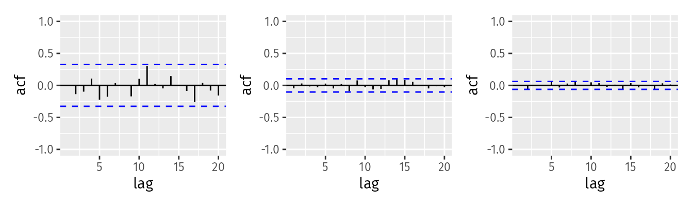

```{r setup, include=FALSE}
knitr::opts_chunk$set(tidy.opts=list(width.cutoff=80), tidy=TRUE, echo = TRUE)
```

# Homework 6

```{r loadLibraries, warning=FALSE, message=FALSE}
library(fpp3)
library(tidyverse)
library(latex2exp)
```

## Exercise 9.1

Figure 9.32 shows the ACFs for 36 random numbers, 360 random numbers and 1000 random numbers.



a. Explain the differences among these figures. Do they all indicate that the data are white noise?

The main differences between these figures is the 95% confidence interval represented by the dashed blue lines and the spikes at each lag point. Each figure indicates that the data is white noise because the spikes are all within the confidence interval. 

b. Why are the critical values at different distances from the mean of zero? Why are the autocorrelations different in each figure when they each refer to white noise?

The confidence interval is calculated as $\pm 1.96 / \sqrt{n}$, where $n$ is the number of values in the series. As $n$ increases, the confidence interval shrinks. In the first figure the confidence interval is larger than the others because there are far fewer observations in the series.

## Exercise 9.2

A classic example of a non-stationary series are stock prices. Plot the daily closing prices for Amazon stock (contained in `gafa_stock`), along with the ACF and PACF. Explain how each plot shows that the series is non-stationary and should be differenced.

```{r, warning=FALSE}
gafa_stock |>
  filter(Symbol == 'AMZN') |>
  gg_tsdisplay(Close, plot_type = 'partial') + 
  labs(title = 'Amazon Closing Price')
```

The ACF plot shows that there is a strong correlation between values of all lags on the chart. This indicates that each value is related to the prior values in the time series. The PACF figure shows that there is no seasonality relationship in the time series.

## Exercise 9.3

For the following series, find an appropriate Box-Cox transformation and order of differencing in order to obtain stationary data.

a. Turkish GDP from `global_economy`.

```{r}
TurkishGDP <- global_economy |>
  filter(Country == 'Turkey')

TurkishGDP |>
  gg_tsdisplay(GDP, plot_type = 'partial') + 
  labs(title = 'Turkish GDP')
```

The figures above indicate that there is a correlation between values in the time series and differencing is required. The PACF shows that there is no seasonality relationship.

```{r}
lambda <- TurkishGDP |>
  features(GDP, features = guerrero) |>
  pull(lambda_guerrero)
lambda
```

We will apply a Box-Cox transformation with the optimal value of $\lambda= 0.16$.

```{r}
TurkishGDP |>
  mutate(GDP = box_cox(GDP, lambda)) |>
  features(GDP, unitroot_ndiffs)
```

```{r, warning=FALSE}
TurkishGDP |>
  gg_tsdisplay(difference(box_cox(GDP, lambda)), plot_type = 'partial') + 
  labs(title = TeX(paste0('Differenced Turkish GDP with $\\lambda = $',round(lambda,2))))
```

b. Accommodation takings in the state of Tasmania for `aus_accommodation`.

```{r}
Tasmania <- aus_accommodation |>
  filter(State == 'Tasmania')

Tasmania |>
  gg_tsdisplay(Takings, plot_type = 'partial') + 
  labs(title = 'Tasmania Takings')
```

The figures above indicate that there is a correlation between values in the time series and differencing is required. The PACF indicates that there is a seasonality component.

```{r}
lambda <- Tasmania |>
  features(Takings, features = guerrero) |>
  pull(lambda_guerrero)
lambda
```

With a near-zero value of $\lambda$, we will apply a log transformation.

```{r}
Tasmania |>
  mutate(Takings = log(Takings)) |>
  features(Takings, unitroot_nsdiffs)
```

As expected, the feature `unitroot_nsdiffs()` recommends 1 seasonal difference. 

```{r}
Tasmania |>
  mutate(Takings = difference(log(Takings), 4)) |>
  features(Takings, unitroot_ndiffs)
```

After applying seasonal differencing, the feature `unitroot_ndiffs()`, shows no additional differencing required.

```{r, warning=FALSE}
Tasmania |>
  gg_tsdisplay(difference(log(Takings), 4), plot_type = 'partial') + 
  labs(title = TeX('Seasonal Differenced Tasmania Takings with $\\lambda = 0$'))
```

There still appears to be some trend in the data which would indicate that it is non-stationary. The data points are not centered on 0, which would seem to indicate a poor model.

c. Monthly sales from `souvenirs`.

```{r}
souvenirs |>
  gg_tsdisplay(Sales, plot_type = 'partial') + 
  labs(title = 'Monthly Sales')
```

The figures above indicate that there is a correlation between values in the time series and differencing is required. The PACF shows that there is no seasonality relationship.

```{r}
lambda <- souvenirs |>
  features(Sales, features = guerrero) |>
  pull(lambda_guerrero)
lambda
```

We will apply a log transformation with the optimal value of $\lambda$ near zero.

```{r}
souvenirs |>
  mutate(Sales = log(Sales)) |>
  features(Sales, unitroot_nsdiffs)
```

As expected, the feature `unitroot_nsdiffs()` recommends 1 seasonal difference. 

```{r}
souvenirs |>
  mutate(Sales = difference(log(Sales), 12)) |>
  features(Sales, unitroot_ndiffs)
```

After applying seasonal differencing, the feature `unitroot_ndiffs()`, shows no additional differencing required.

```{r, warning=FALSE}
souvenirs |>
  gg_tsdisplay(difference(log(Sales), 12), plot_type = 'partial', lag = 36) + 
  labs(title = TeX('Seasonal Differenced Sales with $\\lambda = 0$'))
```

## Exercise 9.5

For your retail data (from Exercise 7 in Section 2.10), find the appropriate order of differencing (after transformation if necessary) to obtain stationary data.

```{r}
set.seed(31415)
myseries <- aus_retail |>
  filter(`Series ID` == sample(aus_retail$`Series ID`, 1))

myseries |>
  gg_tsdisplay(Turnover, plot_type = 'partial') + 
  labs(title = 'Austrailian Retail Trade Turnover')
```

The retail turnover data is non-stationary and appears to require seasonality differencing.

```{r}
lambda <- myseries |>
  features(Turnover, features = guerrero) |>
  pull(lambda_guerrero)
lambda
```

With a near-zero value of $\lambda$, will apply a log transformation. 

```{r}
myseries |>
  mutate(Turnover = log(Turnover)) |>
  features(Turnover, unitroot_nsdiffs)
```

Will apply 1 level of seasonal differencing.

```{r}
myseries |>
  mutate(Turnover = difference(log(Turnover),12)) |>
  features(Turnover, unitroot_ndiffs)
```

After applying the seasonal differencing, additional non-seasonal differecing is not needed.

```{r, warning=FALSE}
myseries |>
  gg_tsdisplay(difference(log(Turnover),12), plot_type = 'partial', lag = 36) + 
  labs(title = 'Seasonaly Differenced Retail Turnover')
```

## Exercise 9.6

Simulate and plot some data from simple ARIMA models.

a. Use the following R code to generate data from an AR(1) model with $\phi_1 = 0.6$ and $\sigma^2 = 1$. The process starts with $y_1 = 0$.

```{r}
y <- numeric(100)
e <- rnorm(100)
for(i in 2:100)
  y[i] <- 0.6 * y[i-1] + e[i]
sim <- tsibble(idx = seq_len(100), y = y, index = idx)
```

b. Produce a time plot for the series. How does the plot change as you change $\phi_1$

```{r}
sim |>
  autoplot(y) + 
  labs(title = TeX('AR(1) model with $\\phi_1$ = 0.6'))
```

The value of $\phi_1$ is the percentage of the prior value in the time series that makes up the subsequent value. If $\phi_1 = 0$, then each value in the series is not based on the previous values and the plot would represent white noise. If $\phi_1 = 1$, each value of the series is equal to the prior value plus a random error and the plot would represent a random walk.

c. Write your own code to generate data from an MA(1) model with $\theta_1 = 0.6$ and $\sigma^2 = 1$.

```{r}
for(i in 2:100)
  y[i] <- 0.6 * e[i-1] + e[i]
sim2 <- tsibble(idx = seq_len(100), y = y, index = idx)
```

d. Produce a time plot for the series. How does the plot change as you change $\theta_1$?

```{r}
sim2 |>
  autoplot(y) + 
  labs(title = TeX('MA(1) model with $\\theta_1$ = 0.6'))
```

The value of $\theta_1$ is the percentage of the prior error in the time series that makes up the subsequent value. If $\theta_1 = 0$, then each value in the series is not based on the previous error and the plot would represent a random walk. If $\theta_1 \ge 1$, the error terms get bigger with the number of lags in the series.

e. Generate data from an ARMA(1,1) model with $\phi_1 = 0.6$, $\theta_1 = 0.6$, and $\sigma^2 = 1$.

```{r}
for (i in 2:100)
  y[i] <- 0.6 * y[i-1] + 0.6 * e[i-1] + e[i]

arma11 <- tsibble(idx = seq_len(100), y = y, index = idx)
```

f. Generate data from an AR(2) model with $\phi_1 = -0.8$, $\phi_2 = 0.3$, and $\sigma^2 = 1$.

```{r}
y[2] <- 0
for (i in 3:100)
  y[i] <- -0.8 * y[i-1] + 0.3 * y[i-2] + e[i]

ar2 <- tsibble(idx = seq_len(100), y = y, index = idx)
```

g. Graph the latter two series and compare them.

```{r}
arma11 |>
  autoplot(y) + labs(title = 'ARMA(1,1)')

ar2 |>
  autoplot(y) + labs(title = 'AR(2)')
```

The ARMA(1,1) model appears to be stationary, centered on 0. For the AR(2) model, since $\phi_2 - \phi_1 > 1$, the model will get get larger as the time series goes on. The graph is also oscillating because the value of $\phi_1 < 0$.

## Exercise 9.7

Consider `aus_airpassengers`, the total number of passengers (in millions) from Australian air carriers for the period 1970-2011.

```{r}
aus_airpassengers |>
  gg_tsdisplay(Passengers, plot_type = 'partial') + 
  labs(title = 'Austrailian Air Passengers')
```

a. Use ARIMA() to find an appropriate ARIMA model. What model was selected? Check that the residuals look like white noise. Plot forecasts for the next 10 periods.

```{r}
fit <- aus_airpassengers |>
  filter(Year <= 2011) |>
  model(ARIMA(Passengers))

report(fit)
```
An ARIMA(0,2,1) model was selected.

```{r}
fit |>
  gg_tsresiduals()
```

The residuals are centered around zero and the ACF appers to show them as white noise.

```{r}
fit |>
  forecast(h = 10) |>
  autoplot(aus_airpassengers) + 
  labs(title = 'Austrailian Air Passengers',
       subtitle = 'ARIMA(0,2,1)',
       y = 'Passengers in millions')
```


b. Write the model in terms of the backshift operator.

$(1-B)^2y_t = (1 -0.88B)\epsilon_t$

c. Plot forecasts from an ARIMA(0,1,0) model with drift and compare these to part a.

```{r}
fit_c <- aus_airpassengers |>
  filter(Year <= 2011) |>
  model(ARIMA(Passengers ~ pdq(0,1,0)))

report(fit_c)
```

```{r}
fit_c |>
  forecast(h = 10) |>
  autoplot(aus_airpassengers) + 
  labs(title = 'Austrailian Air Passengers',
       subtitle = 'ARIMA(0,1,0)')
```

Both models have similar forecasts and confidence intervals. The ARIMA(0,2,1) which was selected has a higher forecast than the ARIMA(0,1,0) model.

d. Plot forecasts from an ARIMA(2,1,2) model with drift and compare these to parts a and c. Remove the constant and see what happens.

```{r}
fit_d <- aus_airpassengers |>
  filter(Year <= 2011) |>
  model(ARIMA(Passengers ~ pdq(2,1,2)))

report(fit_d)
```

```{r}
fit_d |>
  forecast(h = 10) |>
  autoplot(aus_airpassengers) + 
  labs(title = 'Austrailian Air Passengers',
       subtitle = 'ARIMA(2,1,2)')
```

e. Plot forecasts from an ARIMA(0,2,1) model with a constant. What happens?

```{r, warning=FALSE}
fit_e <- aus_airpassengers |>
  filter(Year <= 2011) |>
  model(ARIMA(Passengers ~ 1 + pdq(0,2,1)))

report(fit_e)
```

```{r}
fit_e |>
  forecast(h = 10) |>
  autoplot(aus_airpassengers) + 
  labs(title = 'Austrailian Air Passengers',
       subtitle = 'ARIMA(0,2,1) with constant')
```


## Exercise 9.8

For the United States GDP series from `global_economy`:

a. if necessary, find a suitable Box-Cox transformation for the data.

```{r}
us_gdp <- global_economy |>
  filter(Country == 'United States') |>
  mutate(GDP = GDP / 10^12)

us_gdp |>
  gg_tsdisplay(GDP, plot_type = 'partial') + 
  labs(title = 'United States GDP',
       y = 'GDP ($ Trillions)')

```

```{r}
lambda <- us_gdp |>
  features(GDP, guerrero) |>
  pull(lambda_guerrero)

lambda
  
```

```{r}
us_gdp |>
  gg_tsdisplay(box_cox(GDP,lambda), plot_type = 'partial') + 
  labs(title = TeX(paste0('United States GDP Transformed Box-Cox $\\lambda = $ ',round(lambda,2))),
       y = 'GDP ($ Trillions)')

```

b. fit a suitable ARIMA model to the transformed data using `ARIMA()`.

```{r}
usfit <- us_gdp |>
  model(ARIMA(box_cox(GDP,lambda)))

report(usfit)
```

c. try some other plausible models by experimenting with the orders chosen.

```{r}
usfit2 <- us_gdp |>
  model(search = ARIMA(box_cox(GDP,lambda), stepwise = FALSE, approximation = FALSE),
        arima110 = ARIMA(box_cox(GDP, lambda) ~ pdq(1,1,0)),
        arima120 = ARIMA(box_cox(GDP, lambda) ~ pdq(1,2,0)),
        arima111 = ARIMA(box_cox(GDP, lambda) ~ pdq(1,1,1)),
        arima121 = ARIMA(box_cox(GDP, lambda) ~ pdq(1,2,1)),
        arima210 = ARIMA(box_cox(GDP, lambda) ~ pdq(2,1,0)),
        arima220 = ARIMA(box_cox(GDP, lambda) ~ pdq(2,2,0)))

glance(usfit2) |>
  arrange(AICc) |>
  select(.model:BIC)
```

Tried a number of models with 1 or 2 levels of differencing, and the best model corresponds to the default ARIMA(1,1,0) model identified in part a.

d. choose what you think is the best model and check the residual diagnostics.

```{r}
usfit |>
  gg_tsresiduals()
```

e. produce forecasts of your fitted model. Do the forecasts look reasonable?

```{r}
usfit |>
  forecast(h = 5) |>
  autoplot(us_gdp)
```

f. compare the results with what you would obtain using `ETS()`.

```{r}
ets <- us_gdp |>
  model(ETS(GDP))

report(ets)
```

```{r}
ets |>
  forecast(h = 5) |>
  autoplot(us_gdp)
```

The ETS model forecast GDP with a slightly lower slope than the ARIMA(1,1,0) model. Both models are reasonable based on the plots of the data.
