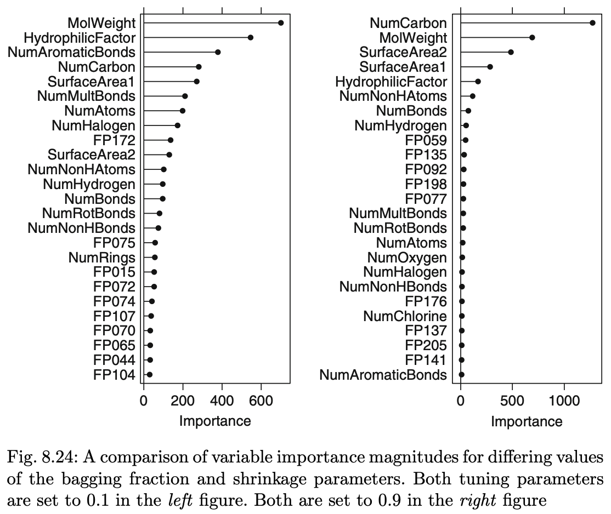

```{r setup, include=FALSE}
knitr::opts_chunk$set(tidy.opts=list(width.cutoff=80), tidy=TRUE, echo = TRUE)
```

# Homework 9

```{r, warning=FALSE, error=FALSE}
library(tidyverse)
library(AppliedPredictiveModeling)
library(mlbench)
library(caret)
library(randomForest)
library(party)
library(gbm)
library(Cubist)
library(rpart)
library(rpart.plot)
library(ipred)
```

## Exercise 8.1

Recreate the simulated data from Exercise 7.2.

```{r}
set.seed(31415)
simulated <- mlbench.friedman1(200, sd = 1)
simulated <- cbind(simulated$x, simulated$y) |> as.data.frame()
colnames(simulated)[ncol(simulated)] <- 'y'
```

a. Fit a random forest model to all of the predictors, then estimate the variable importance scores:

```{r}
model1 <- randomForest(y ~ ., data = simulated, importance = TRUE, ntree = 1000)
(rfImp1 <- varImp(model1, scale = FALSE))
```

Did the random forest model significantly use the uniformative predictors (`V6`-`V10`)?

The importance of predictors `V6` - `V10` are all near zero which indicates that have little impact on the model.

b. Now add an additional predictor that is highly correlated with one of the informative predictors.

```{r}
simulated$duplicate1 <- simulated$V1 + rnorm(200) * .1
cor(simulated$duplicate1, simulated$V1)
```

Fit another random forest model to these data. Did the importance score for `V1` change? 

```{r}
model2 <- randomForest(y ~ ., data = simulated, importance = TRUE, ntree = 1000)
(rfImp2 <- varImp(model2, scale = FALSE))
```

The importance of `V1` decreased in the new model, but by less than `duplicate1`.

What happens when you add another predictor that is also highly correlated with `V1`?

```{r}
simulated$duplicate2 <- simulated$V1 + rnorm(200) * .1
cor(simulated$duplicate2, simulated$V1)
```

```{r}
model3 <- randomForest(y ~ ., data = simulated, importance = TRUE, ntree = 1000)
(rfImp3 <- varImp(model3, scale = FALSE))
```

Introducing another highly correlated variable has further reduced the importance of `V1`.

c. Use the `cforest` function in the **party** package to fit a random forest model using conditional inference trees. The **party** package function `varimp` can calculate predictor importance. The **conditional** argument of that function toggles between the traditional importance measure and the modified version described in **Strobl et al. (2007)**. Do these importances show the same pattern as the traditional random forest model?

```{r}
model4 <- cforest(y ~ ., data = simulated[, c(1:11)])
(rfImp4 <- party::varimp(model4, conditional = TRUE))
```

The predictors are ranked in the same order as the initial model. 

d. Repeat this process with different tree models, such as boosted trees and Cubist. Does the same pattern occur?

**Boosted Trees**

```{r}
model5 <- gbm(y ~ ., data = simulated[,c(1:11)], distribution = 'gaussian')
(rfImp5 <- varImp(model5, numTrees = 50))
```

**Cubist**

```{r}
model6 <- train(y ~ ., data = simulated[,c(1:11)], method = 'cubist')
rfImp6 <- varImp(model6, scale = FALSE)
rfImp6$importance
```

Both the random forest and boosted trees models rank the predictors in the same order, but the cubist model significantly different.

## Exercise 8.2

Use a simulation to show tree bias with different granularities.

```{r}
a <- sample(1:10 / 10, 1000, replace = TRUE)
b <- sample(1:100 / 100, 1000, replace = TRUE)
c <- sample(1:1000 / 1000, 1000, replace = TRUE)
d <- sample(1:10000 / 10000, 1000, replace = TRUE)
y <- a + b + c + d
simulation = data.frame(a, b, c, d, y)
```

Created four random variables with increasing granularity. Predictor `a` has the lowest and `d` has the highest.

```{r}
model <- rpart(y ~ ., data = simulation)
rpart.plot(model)
```

```{r}
varImp(model)
```

With the four random samples a-d, should all have about the same importance.

## Exercise 8.3

In stochastic gradient boosting the bagging fraction and learning rate will govern the construction of the trees as they are guided by the gradient. Although the optimal values of these parameters should be obtained through the tuning process, it is helpful to understand how the magnitudes of these parameters affect magnitudes of variable importance. Figure 8.24 provides the variable importance plots for boosting using two extreme values for the bagging fraction (0.1 and 0.9) and the learning rate (0.1 and 0.9) for the solubility data. The left-hand plot has both parameters set to 0.1, and the right-hand plot has both set to 0.9:



a. Why does the model on the right focus its importance on just the first few of predictors, whereas the model on the left spreads importance across more predictors?

The bagging fraction is a percentage of data used to generate the tree. Shrinkage is the learning rate and is applied to each tree in the expansion. A higher learning rate leads to fewer iterations when generating the model. 

b. Which model do you think would be more predictive of other samples?

THe model on the left would be more predictive of other samples because of the lower learning rate, it doesn't focus on just a few predictors.

c. How would increasing interaction depth affect the slope of predictor importance for either model in Fig 8.24?

The interaction depth is the number of divisions to perform on the tree. With more splits, the importance of predictors increases, which allows lower importance predictors to contribute more.

## Exercise 8.7

Refer to Exercise 6.3 and 7.5 which describe a chemical manufacturing process. Use the same data imputation, data splitting, and pre-processing steps as before and train several tree-based models:

### From Homework 7

```{r}
data(ChemicalManufacturingProcess)
imputed <- predict(preProcess(ChemicalManufacturingProcess, method = 'bagImpute'), ChemicalManufacturingProcess)

X <- imputed |>
  select(-Yield)
y <- imputed$Yield

X <- X[,-nearZeroVar(X)]

train <- createDataPartition(y, p = .8, list = FALSE)
X_train <- X[train,]
X_test <- X[-train,]
y_train <- y[train]
y_test <- y[-train]
```

### Single Trees

```{r, warning=FALSE}
stModel <- train(X_train, y_train, method = 'rpart',
                tuneLength = 10, trControl = trainControl(method = 'cv'))
stPred <- predict(stModel, newdata = X_test)
stResult <- data.frame(as.list(postResample(pred = stPred, obs = y_test))) |>
  mutate(model = 'Single Trees') |>
  relocate(model, RMSE, Rsquared, MAE)
stResult
```

### Bagged Trees

```{r, warning=FALSE}
btModel <- ipredbagg(y_train, X_train)
btPred <- predict(btModel, newdata = X_test)
btResult <- data.frame(as.list(postResample(pred = btPred, obs = y_test))) |>
  mutate(model = 'Bagged Trees') |>
  relocate(model, RMSE, Rsquared, MAE)
btResult
```

### Random Forest

```{r}
rfModel <- randomForest(X_train, y_train)
rfPred <- predict(rfModel, newdata = X_test)
rfResult <- data.frame(as.list(postResample(pred = rfPred, obs = y_test))) |>
  mutate(model = 'Random Forest') |>
  relocate(model, RMSE, Rsquared, MAE)
rfResult
```

### Boosted Trees

```{r, warning=FALSE}
gbmModel <- gbm.fit(X_train, y_train, distribution = 'gaussian', verbose = FALSE, n.trees = 100)
gbmPred <- predict(gbmModel, newdata = X_test)
gbmResult <- data.frame(as.list(postResample(pred = gbmPred, obs = y_test))) |>
  mutate(model = 'Boosted Trees') |>
  relocate(model, RMSE, Rsquared, MAE)
gbmResult
```

### Cubist

```{r, warning=FALSE}
cModel <- cubist(X_train, y_train)
cPred <- predict(cModel, newdata = X_test)
cResult <- data.frame(as.list(postResample(pred = cPred, obs = y_test))) |>
  mutate(model = 'Cubist') |>
  relocate(model, RMSE, Rsquared, MAE)
cResult
```

### Summary

```{r}
stResult |>
  union(btResult) |>
  union(rfResult) |>
  union(gbmResult) |>
  union(cResult) |>
  arrange(desc(Rsquared))
```

a. Which tree-based regression model gives the optimal resampling and test set performance?

The random forest model produced the highest $R^2$ value.

b. Which predictors are most important in the optimal tree-based regression model? Do either the biological or process variables dominate the list? How do the top 10 important predictors compare to the top 10 predictors from the optimal linear and nonlinear models?

```{r}
top10 <- varImp(rfModel) |>
  arrange(desc(Overall)) |>
  head(10)
top10
```

The tree model has most of the same predictors in the top 10 as the linear and nonlinear models produced in previous assignments.

c. Plot the optimal single tree with the distribution of yield in the terminal nodes. Does this view of the data provide additional knowledge about the biological or process predictors and their relationship with yield?

```{r}
rpartModel <- rpart(Yield ~ ., data = imputed)
rpart.plot(rpartModel)
```

This graphical view gives you an indication of the combinations of predictors that affect the yield.


